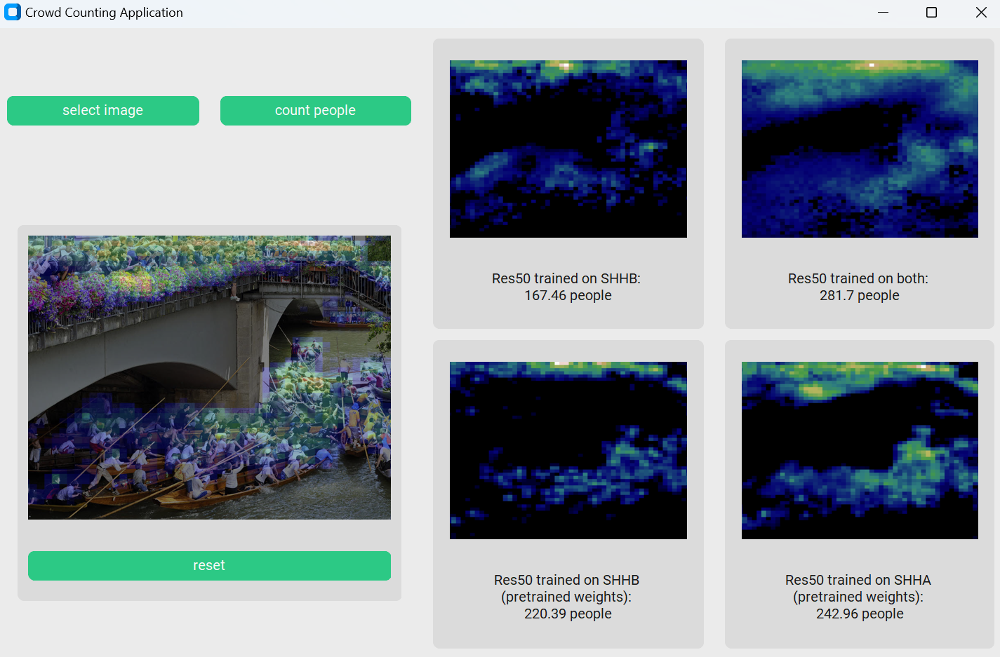

# Development of a deep learning model for crowd counting

## How to use this code

### 1. for Training:
The code is an updated an adjusted version of the Crowd Counting Framework by Gao et al. (https://github.com/gjy3035/C-3-Framework).
- requirements: Python 3.X, Pytorch 2.0, other libs in requirements.txt
- set variables in config.py: dataset (SHHA, SHHB or SHHM), exp path, training with or without GPU support, other hyperparameters
- in datasets/SHHX/setting.py set path to data with labels
- run train.py

### 2. to use the crowd counting application:
- additional required libraries: PIL and customtkinter
- change path to 4 models that will be compared in gui.py
- start gui.py, select image in file system and see results

